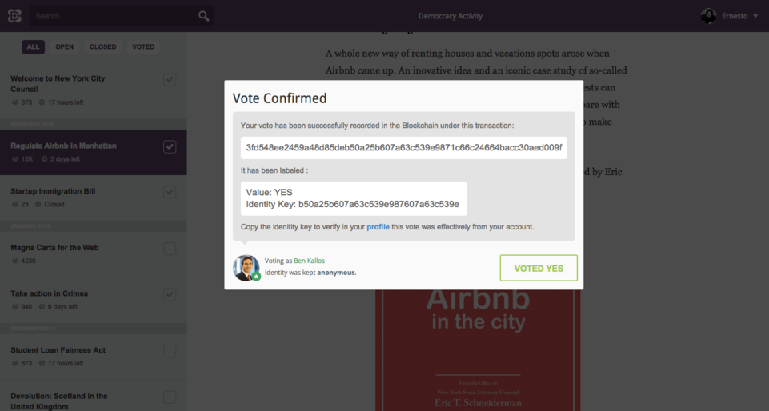

# Votechains

> Motivating democracy. Unstoppable.

## Abstract

***Draft***

## Motivation

***Draft***

## Related Projects

Below is a short overview of existing research, organizations and implementations of blockchain based democracy applications.

### Propose and Vote

Voting is a key functionality of blockchain technology. The underlying consensus protocols on most distritubted peer-to-peer solutions always have to include ways to update protocols and restore consensus upon disputes. A prominent example is the Bitcoin Improvement Proposal [BIP0034](https://github.com/bitcoin/bips/blob/master/bip-0034.mediawiki#Specification), of the infamous crypto-currency [Bitcoin](http://bitcoin.org), proposing miner behaviour on softforking mechanics.

This is voting on a very technical level and not considered part of this whitepaper.

The following projects rather focus on applications on top of blockchains, enabling democratic participation in any kind of groups or societies.

[DemocracyOS](http://democracyos.org/) is a web-application from Argentina which allows you to propose, debate and vote online. The team discussed blockchain integration back in 2015 [once](http://blog.democracyos.org/post/114076491913/blockchain-support-for-democracyos-we-want-to-add) and [twice](http://blog.democracyos.org/post/122357355613/were-making-a-live-hangout-to-talk-decentralized). An article on Newschallange contains first [mockups](https://www.newschallenge.org/challenge/elections/entries/blockchain-support-for-open-source-platform-democracyos).

[Democracy.earth](http://democracy.earth/) is a follow-up project by [Santiago Siri](https://www.youtube.com/watch?v=eOYcaRWMbyE) and [Pia Mancini](https://www.ted.com/talks/pia_mancini_how_to_upgrade_democracy_for_the_internet_era) from DemocracyOS who relocated to the United States recently. The project is currently creating a community, recruiting enthusiasts and researching on blockchain voting and identity.

[Follow My Vote](https://followmyvote.com/), formerly 'Vote DAC' ([PDF](https://followmyvote.com/wp-content/uploads/2014/08/The-Key-To-Unlocking-The-Black-Box-Follow-My-Vote.pdf)) is a distributed autonomous company (DAC) emerged from the  [Bitshares community](https://bitsharestalk.org/index.php?board=63.0). It's currenlty [heavily developing](https://github.com/FollowMyVote/StakeWeightedVoting/) a stake-weighted blockchain voting DAC by a team around [Adam Kaleb Ernest](https://www.youtube.com/watch?v=TQMoKiP5q7Y).

[Public Votes](http://publicvotes.org/) is an [Ethereum](http://ethereum.org) voting application designed and implemented by [Dominik Schiener](https://medium.com/@DomSchiener). Both his [proposal](http://schiener.me/2015/openvotes-voting/) and more recent [analytics](http://schiener.me/2015/voting-on-ethereum-analysis/) are highlighting advantages and issues arising with Ethereum and blockchain voting. The source code is available on [Github](https://github.com/domschiener/publicvotes).

In 2014 [Jesper Borgstrup](https://jesper.borgstrup.dk/2015/01/masters-thesis-private-trustless-decentralized-message-consensus-voting-schemes/) wrote a master thesis on 'Private, trustless and decentralized message consensus and voting schemes' ([PDF](https://jesper.borgstrup.dk/master-thesis-report.pdf)). The protocol uses blockchain-technology and invertible bloom lookup tables for defining deadlines and timestamping of messages. Linkable ring signatures provide a scheme suitable for signing votes. Source code is available on [Github](https://github.com/jesperborgstrup/PyBitmessageVote).

* BitVote, a timebased voting DApp on Ethereum [whitepaper](https://github.com/arkbg1/BitVote/wiki/*A*-plan), [video](https://www.youtube.com/watch?v=z-BtgF3oqoA), [demo](https://bitvote.github.io/)
* [Nemos.io](http://nemos.io/) blockchain-proofed decision making on Ethereum without gas costs: [source code](https://github.com/netparty-france/nemos.io/)
* [Blockchain Apparatus](http://blockchainapparatus.com/voting/) a blockchain secured voting machine
* [BitCongress](http://www.bitcongress.org/), decentralized voting platform: [whitepaper](http://www.bitcongress.org/BitCongressWhitepaper.pdf)
* SureVoting, WVU student government voting app: [news](http://www.thedaonline.com/news/article_c23dd902-8e7c-11e5-881d-db3cafa77e63.html), [news](http://www.coindesk.com/west-virginia-university-student-government-blockchain-voting/)
* [Votecoin](https://votecoin.wordpress.com), a hash based voting technology
* Quadratic Voting: [camp](http://quadraticvoting.on.ether.camp/ide.html), [video](https://www.youtube.com/watch?v=xz9dGRs7FOQ), [paper](http://papers.ssrn.com/sol3/papers.cfm?abstract_id=2003531), [blog](http://ericposner.com/quadratic-voting/)
* [AgoraVoting](https://agoravoting.com/) had the [idea](https://blog.agoravoting.org/index.php/2013/11/28/a-bitcoin-based-completely-distributed-voting-system/) for a distributed voting system but [failed](https://blockchain.info/address/1EwqtN6GwHmkfYEfxGhuVcjrNBdQwvXMd3) to crowdfund the development
* [V-Initiative](http://www.v-initiative.org/) proposed a decentralized voting app but the project seems [dead](http://v-app.io/landing).

### Identity and Authentication

***Draft***

* Schiener, Dominik (2015): A new Identity Model with Prototype [blog](http://composui.com/2015/09/08/a-treatise-on-identity-part-2-a-new-identity-model-with-prototype/)
* [Onename](https://onename.com/), blockchain id
* [ShoCard](http://www.shocard.com/), blockchain identity card
* [EtherID](http://etherid.org/), the Ethereum name registry: [source code](https://github.com/lexansoft/EtherID.org)
* [Proof-of-Individuality](http://proofofindividuality.tk/) anti-sybil token: [source code](https://github.com/d11e9/poi)
* [EtherReal](http://etherre.al/wp/), trustless proof of personal identity

### Storage

***Draft***

* [Storj](http://storj.io/) decentralized blockchain cloud storage
* [IPFS](https://ipfs.io/) peer-to-peer hypermedia protocol
* [SAFE Network](https://safenetwork.org/), a peer-to-peer data storage network
* [Swarm](https://github.com/ethereum/go-ethereum/wiki/Swarm---distributed-preimage-archive) distributed preimage archive
* [Sia](http://sia.tech/) distributed collaborative data storage by managed smart contracts
* [Filecoin](http://filecoin.io/) data storage network based on bitcoin: [whitepaper](http://filecoin.io/filecoin.pdf)
* [Eris](https://erisindustries.com/) distributed file storage services by smart contracts

## Target Issues

## Proposed Solutions

## Outlook

## Contribute

## License

This paper is available in the [public domain](LICENSE.md).
